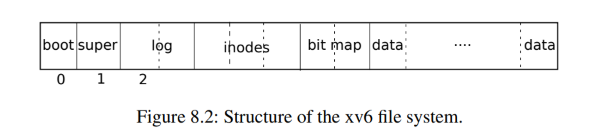
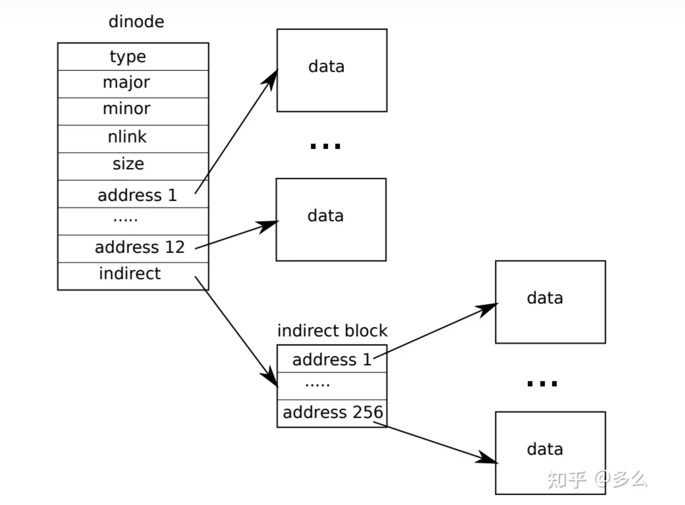

# Lab: file system
本实验所用的代码在分支 fs
```
git checkout fs
```

## 课程笔记
****
文件系统章节需要特别关注以下3个问题  
	- 如何在磁盘上排布文件系统。例如目录和文件，它们都需要以某种形式在磁盘上存在  
	- crash safety。文件系统的操作过程中，计算机崩溃了，在重启之后的文件系统如何能够正常运行  
	- 不同的进程可能同时在文件系统上运行 ，因此文件系统代码必须必须协调以保持不变量  
	- 文件系统所在的硬件设备通常都比较慢，应尽量避免写入磁盘。SSD的读取性能在0.1-1ms，HDD的读取性能10ms。所有的文件系统都有buffer cache  

### 概述
****
xv6文件系统实现分为7层  
	- 文件描述符层：使用文件系统接口抽象系统资源，比如管道、设备、文件等等   
	- 路径名层：路径名提供了分层路径名，并通过递归查找来解析它们  
	- 目录层：将每个目录实现为一种特殊的索引结点，每个目录项包含一个文件名和索引号  
	- 索引结点层：提供单独的文件，每个文件表示为一个索引结点，其中包含唯一的索引号和一些保存文件数据的块    
	- 日志记录层：允许更高层在一次事务中将更新包装到多个块，并确保在遇到崩溃时自动更新这些块  
	- 缓冲区高速缓存层：缓存磁盘块并同步对它们的访问，确保每次只有一个内核进程可以修改存储在任何特定块中的数据  
	- 磁盘：读取和写入硬盘上的块  

硬盘上的最小存储单元为**sector** ，512字节，block是文件存储的最小单元，1024字节。xv6磁盘的分布如下：总共为1000个block  
	- boot block  
	- super block：包含了文件系统的元数据(块中文件系统大小，data blcok的数量，inode的数量，日志中的块的数量)；  
	-   30  个log       blcok   
	-   13  个inode   block  
	-     1  个bitmap block  
	- 954  个data     blcok  


### Buffer cache层
****
Buffer cache有两个任务：  
1. 同步对磁盘块的访问，以确保磁盘块在内存中只有一个副本，并且一次只有一个内核线程使用该副本  
2. 缓存常用块，以便不需要从慢速磁盘重新读取它们，代码在 **_bio.c_** 中  

Buffer cache层导出的主接口主要是**bread**和**bwrite**，前者获取一个buf，其中包含一个可以在内存中读取或者修改的块的副本，后者将修改后的缓冲区写入磁盘上的相应块。内核线程必须通过调用**brelse**释放缓冲区。

Buffer cache每个缓冲区使用一个睡眠锁，以确保每个缓冲区(也是每个磁盘块)每次只被一个线程使用。**bread**返回一个上锁的缓冲区，**brelse**释放锁。

Buffer cache中保存磁盘块的缓冲区数量固定，采用LRU技术来申请新的缓冲区。

__*代码解析*__  

存储文件缓冲区的内容采用结构体`buf`  
```c
struct buf {
  int valid;   // has data been read from disk?  表示缓冲区是否包含块的副本
  int disk;    // does disk "own" buf?            表示缓冲区是否已交给磁盘
  uint dev;    //
  uint blockno; // buf 和 block 是一一对应的
  struct sleeplock lock;
  uint refcnt;  //                                表示某个线程的引用数量
  struct buf *prev; // LRU cache list
  struct buf *next;
  uchar data[BSIZE];
};
```




将存储文件缓冲区内容的结构体进一步封装得到一个循环链表
```c
struct {
  struct spinlock lock;
  struct buf buf[NBUF];
  // Linked list of all buffers, through prev/next.
  // Sorted by how recently the buffer was used.
  // head.next is most recent, head.prev is least.
  struct buf head;
} bcache;
```

Buffer cache的初始化函数位于**kernel/main.c**，调用函数**binit**，初始化一个全局变量**bcache**，**buf**是一个双向链表的节点。

在(__*kernrl/bioc.c*__)
1. `bread`函数，功能是返回一个拥有指定块内容(根据`blockno`指定)的缓冲区。调用`bget`函数选择一块缓冲区，并判断这块缓冲区是否已经指向指定的块，若是则返回，若否，则该缓冲区向磁盘中读取。  
2. `bget`函数扫描缓冲区双向链表，查找具有给定设备和block号，bget获取缓冲区的睡眠锁，然后返回该缓冲区。如果给定的block没有缓冲区，则需要创建一个。b->valid确保了bread将从磁盘读取块数据，而不是使用缓冲区以前的内容。==因此每个文件块都只有一个文件缓冲区==  注意：一旦通过调用**bread**函数返回一块缓冲区，用户可以对缓冲区进行读或者写操作，并且需要在释放缓冲区之前通过**bwrite**函数将更改的数据写入磁盘。  

### 日志层
****
文件系统设计的一个问题就是文件系统操作期间发生的崩溃问题。因为对于文件系统的操作往往是对多个磁盘块的操作，而这个操作不是原子性的，日志层的设计可以保证文件系统的系统调用是原子性的并且支持快速恢复。

为了解决这一问题，xv6将数据block又分为了数据block和日志block，系统调用不会直接写入磁盘，而是在日志层放置它希望进行的所有磁盘写入的操作，一旦系统调用记录了它的所有操作，它就会向磁盘写入一条特殊的commit记录，表明日志包含一个完整的操作。

如果系统崩溃并重新启动，则在运行任何进程之前，文件系统代码将按照如下方式恢复。如果日志标记为完整的操作，则会写入磁盘，不然则会忽略该日志，并且擦除日志。

在超级块当中的logstart会指出日志区的起始块，第一个块存储的是logheader，后面29个块都是存储log。loghead块会维护一个数组来分别记录日志块要更新的目标块，日志块记录的是更新的内容。


__*代码解析*__

xv6的排布中一开始有一个`header log`，也就是作为一个提交记录，里面包含了  
	- 数字n代表有效的 log block 的数量（已经commit表明是一个完整的事件）  
	- 每个log block的实际对应的block编号(ps：数组大小为30)  

当文件系统在运行的时候，在内存中也有一份`head block`的拷贝，拷贝中包括`n`和`block`编号的数组，当然实际要写入的`block`也会缓存在`block cache`中，但是写入是向`log block`写入的。

```c
// Contents of the header block, used for both the on-disk header block
// and to keep track in memory of logged block# before commit.
struct logheader {
  int n;
	  int block[LOGSIZE];//30
};

// 这个数据结构不要以为就是存储在log block,这是在内存中存储方式 
struct log {
  struct spinlock lock;
  int start;
  int size;
  int outstanding; // how many FS sys calls are executing.
  int committing;  // in commit(), please wait.
  int dev;
  struct logheader lh;
};
```

因此每个文件系统操作必须表明事务的开始和结束，其中**begin_op**和**end_op**分别表示事务的开始和结束。xv6文件系统操作最开始是**begin_op**，再是实现系统调用的代码，最后是**end_op**，**end_op**中会实现commit操作，先将数据写入到log中，之后再写入commit record或者log header。

对于文件系统的一次操作通常是如下的  
```
bp = bread(...) // 获得文件高速缓冲区的地址
modify bp->data[]
log_write(bp)
brelase(bp)
```

接下来看看是如何具体实现文件到磁盘的写入

在`begin_op`和`end_op`之间的写操作都会调用**log_write** 函数 ps:这里`log`就是上述结构体的一个全局变量   
1. 先获取log header的锁  
2. 查看该block是否已经被log记录上 ，如果是则不用操作
3. 如果该block还没有被记录，则会对n加1，并将该block记录在列表的最后  
```c
void
log_write(struct buf *b)
{
  int i;
  acquire(&log.lock);
  if (log.lh.n >= LOGSIZE || log.lh.n >= log.size - 1)
    panic("too big a transaction");

  if (log.outstanding < 1)
    panic("log_write outside of trans");

  for (i = 0; i < log.lh.n; i++) {
    if (log.lh.block[i] == b->blockno)   // log absorption
      break;
  }
  log.lh.block[i] = b->blockno;
  if (i == log.lh.n) {  // Add new block to log?
    bpin(b);
    log.lh.n++;
  }

  release(&log.lock);
}
```
每次文件系统调用的最后都会调用**end_op**函数，  
1. 复杂情况的处理  
2. 调用commit函数  
接下来的执行中，**commit**函数主要执行4步操作  
1. write_log函数将所有存于内存中的log header中的block编号对应的block，从`block cache`写入到磁盘中的`log`区域
2. write_head函数将内存中的log header写入到磁盘中  
```c
// Copy modified blocks from cache to log.
static void
write_log(void)
{
  int tail;
  for (tail = 0; tail < log.lh.n; tail++) {
    struct buf *to = bread(log.dev, log.start+tail+1); // log block
    struct buf *from = bread(log.dev, log.lh.block[tail]); // cache block
    memmove(to->data, from->data, BSIZE);
    bwrite(to);  // write the log
    brelse(from);
    brelse(to);
  }
}
```
函数当中依次遍历log中记录的block，先将cache block中的数据拷贝到log block，最后在将log block写回到磁盘，这样的做法可以确保需要写入的block都记录在log中。但是此时依旧没有commit。  

真正的commit发生在这里，称为`commit point`  
```c
// Write in-memory log header to disk.
// This is the true point at which the
// current transaction commits.
static void
write_head(void)
{
  struct buf *buf = bread(log.dev, log.start);
  struct logheader *hb = (struct logheader *) (buf->data);
  int i;
  hb->n = log.lh.n;
  for (i = 0; i < log.lh.n; i++) {
    hb->block[i] = log.lh.block[i];
  }
  bwrite(buf);  // 写入到log header  commit point
  brelse(buf);
}
```
其实一开始需要commit的记录是记录在**log**结构体当中的，函数先读取log的head block，先将n拷贝到block中，再将所有的block编号拷贝到header的列表中  
3. **install_trans**函数  
```c
// Copy committed blocks from log to their home location
static void
install_trans(int recovering)
{
  int tail;

  for (tail = 0; tail < log.lh.n; tail++) {
    struct buf *lbuf = bread(log.dev, log.start+tail+1); // read log block
    struct buf *dbuf = bread(log.dev, log.lh.block[tail]); // read dst
    memmove(dbuf->data, lbuf->data, BSIZE);  // copy block to dst
    bwrite(dbuf);  // write dst to disk
    if(recovering == 0)
      bunpin(dbuf);
    brelse(lbuf);
    brelse(dbuf);
  }
}
```
先读取log block，再读取文件系统对应的block。将数据从log拷贝到文件系统，最后将文件系统block缓存落盘。这里实际上就是将block数据从log中拷贝到了实际的文件系统block中。 注意：感觉这边的实现还是比较奇怪，应该是xv6系统的问题  

4. **write_head**函数将事务从log中删除  

### 系统恢复过程
****
当系统crash并重启了之后会调用**initlog**函数  
```c
void
initlog(int dev, struct superblock *sb)
{
  if (sizeof(struct logheader) >= BSIZE)
    panic("initlog: too big logheader");
    
  initlock(&log.lock, "log");
  log.start = sb->logstart;
  log.size = sb->nlog;
  log.dev = dev;
  recover_from_log();
}
```
1. 初始化全局变量log  
2. 调用recover_from_log  
接下来，**recover_from_log**函数主要是恢复log块中的数据。首先调用**read_head**函数从磁盘中读取header，再调用**install_trans**函数。  
```c
static void
recover_from_log(void)
{
  read_head();
  install_trans(1); // if committed, copy from log to disk
  log.lh.n = 0;
  write_head(); // clear the log
}
```

### 索引节点层
****
在往上层看便接触到文件，用户可以使用文件名打开一个文件`fd = open("x/y",w)`，然后使用文件描述符编辑文件`write(fd,"abc",3)`。并可以使用`link`和`unlink`将文件名和inode建立连接。==注：文件名只是和inode相关联，而真正指向文件对象的是文件描述符。==一个文件(inode)只能在link count为0的时候被删除，实际中还有一个openfd count，也就是当前打开了文件的文件描述符计数。  

inode存储在磁盘的inode block中，其具体存在哪一个block可以通过以下的计算方式得到，假如inode是64字节。  
$$
32+\frac{inode*64}{1024}
$$

inode结构体如下  ps xv6内核中又对其进行了进一步的封装在一个更大的结构体，与管道，设备文件封装在了一起
```c
// On-disk inode structure
struct dinode {
  short type;           // File type 表明是文件还是目录
  short major;          // Major device number (T_DEVICE only)
  short minor;          // Minor device number (T_DEVICE only)
  short nlink;          // Number of links to inode in file system
  uint size;            // Size of file (bytes)
  uint addrs[NDIRECT+1];   // Data block addresses 这里的NDIRECT为12，这12个block指向了构成文件的前12个block，最后一个block[12]保存的是indirect block number指向另一个block
};
/*
间接block存储了256个block编号，因此可以推断每个block编号为4byte
也就是说原始的xv6每个inode文件可以分配268*1024=268kb
*/
```
根据以上信息，比如要读取一个文件的第8000个字节，应该用8000/1024=7，可以直接查找第7个direct block，再求余数可以得到在这个block的哪个位置。  

### 目录
****
文件系统层次化的命名空间在这里实现，可以在文件系统中保存对用户友好的文件名，unix文件系统的目录本质上一个文件加上一些文件系统能够理解的结构。每个目录包含了directory entries，每一条entry都有固定的格式  
```
entry : inode num(2byte) file name(14byte)
```
对于实现路径名查找，这里的信息就是足够的了。比如说用户查找“/x/y"，这里根据文件名需要先从root inode开始查找，root inode一般会有固定的编号，在xv6中为1。inode1自然保存在block32中64到128byte的位置。然后扫描root inode中的所有内容，也就是需要读取direct block number和indirect block number指向的block，里面会存储entry，比如这样的  
```
entry : {num} "y"
```

### 实例
****
输入 `echo  "hi" > x `接下来会发生多次对block的写入  
```
--- 阶段1 creat the file
write:33     //标记该inode将被使用，inode结构体中有type字段表示是否空闲
write:33     //实际写入inode的内容，包括 linkcount 为1等内容
write:46     //因为本文件创建在根目录下，所以此次是要对根目录内容增加一个entry
write:32     //根目录的内容发生改变，比如文件大小，需要在相应的inode更新
write:33     

--- 阶段2 write "hi" to the file
write:45     //更新bitmap，找到未使用的一个data block，未使用的data block对应bit 0
write:595    //文件系统挑选了595，所以inode的第一个dir blcok是595
write:595
write:33     //更新inode的size，更新第一个dir blcok
--- 阶段3 write "\n" to the file
write:595
write:33
```

### xv6创建inode的代码
****
接下来介绍系统调用函数**sys_open**函数  
(__*kernel/sysfile.c*__)包含了所有与文件系统相关的函数。分配inode发生在***sys_open***函数中。  

该函数会调用***create***函数，在***create***函数中首先会解析路径名并找到最后一个目录查看文件是否存在，如果存在就会返回错误。之后就会调用***ialloc*** 函数，这个函数会为文件分配inode。  
```c
// Allocate an inode on device dev.
// Mark it as allocated by  giving it type type.
// Returns an unlocked but allocated and referenced inode,
// or NULL if there is no free inode.
struct inode*
ialloc(uint dev, short type)
{
  int inum;
  /*
  buf是在内存中的文件缓冲区，之前提到的链表
  dip是一个inode的结构
  */
  struct buf *bp;
  struct dinode *dip;

  for(inum = 1; inum < sb.ninodes; inum++){  // sb 是全局变量，指向superblock
    /*  遍历所有inode  */
    bp = bread(dev, IBLOCK(inum, sb));  // 获取该inode对应的缓冲区
    /*
    上一行发生的是根据inode求出相应的blcok
    下一行发生的是根据inode求出这个block中存储的那个inode
    */
    dip = (struct dinode*)bp->data + inum%IPB;
    if(dip->type == 0){  // a free inode
      memset(dip, 0, sizeof(*dip));
      dip->type = type;
      log_write(bp);   // mark it allocated on the disk
      brelse(bp);
      return iget(dev, inum);
    }
    brelse(bp);
  }
  printf("ialloc: no inodes\n");
  return 0;
}
```
***ialloc***函数会遍历所有可能的inode编号，找到inode所在的block，再看位于block中的inode数据的type字段，如果这是一个空闲的inode，那么将其type字段设置为文件，这会将inode标记为已被分配。函数中的***log_write***就是之前整个输出的第一个。

## Large files
****
在本实验的目的在于增加`xv6`文件的最大大小。`xv6`文件被限制268个块即268*BSIZE字节(BGSIZE为1024)。这主要是因为`inode`包含12个`direct`和256个`indirect`

可以在命令行输入测试命令得到当前每个文件可占的最多block
```
bigfile
```

该任务的实现思路是使得每一个`inode`支持1个双层间接块，相当于是256*256个`block`。

首先需要理解一下`bmap`函数
```c
/*
bmap处理两种块号，bn为逻辑块号，相对于文件开头的块号
而ip->addrs[]和bread()的参数都是磁盘块号
此函数主要是建立逻辑块号与磁盘块号的映射
*/
static uint
bmap(struct inode *ip, uint bn)
{
  uint addr, *a;
  struct buf *bp;
  // 直接块的映射
  if(bn < NDIRECT){
    if((addr = ip->addrs[bn]) == 0)
      ip->addrs[bn] = addr = balloc(ip->dev);
    return addr;
  }
  // 间接块的映射
  bn -= NDIRECT;
  if(bn < NINDIRECT){
    // Load indirect block, allocating if necessary.
    // 若间接块所映射的磁盘还没有分配，则分配一个
    if((addr = ip->addrs[NDIRECT]) == 0)
      ip->addrs[NDIRECT] = addr = balloc(ip->dev);
    // 读取间接块的内容到cache
    bp = bread(ip->dev, addr);
    // 每个blockno为4个字节
    a = (uint*)bp->data;
    if((addr = a[bn]) == 0){
      a[bn] = addr = balloc(ip->dev);
      log_write(bp);
    }
    brelse(bp);
    return addr;
  }
  panic("bmap: out of range");
}
```

因此实现思路就是将原来的12个直接映射+1个一级映射修改为11个直接映射+1个一级间接映射+一个二级映射

注意：  
1. `inode`在代码中建了两种数据形式   
```c
// On-disk inode structure   真正存储在inode block中的数据结构
struct dinode {
  short type;           // File type
  short major;          // Major device number (T_DEVICE only)
  short minor;          // Minor device number (T_DEVICE only)
  short nlink;          // Number of links to inode in file system
  uint size;            // Size of file (bytes)
  uint addrs[NDIRECT+2];   // Data block addresses
};

// in-memory copy of an inode  在内存中用的inode数据结构
struct inode {
  uint dev;           // Device number
  uint inum;          // Inode number
  int ref;            // Reference count
  struct sleeplock lock; // protects everything below here
  int valid;          // inode has been read from disk?

  short type;         // copy of disk inode
  short major;
  short minor;
  short nlink;
  uint size;
  uint addrs[NDIRECT+2];
};
```

 2. 除了需要在`bmap`函数中修改每个`inode`映射的`block`，还需要在`itrunc`函数中丢弃某个`inode`对于`block`的映射

代码的具体实现可以查看 commit 记录 large file 若干条  