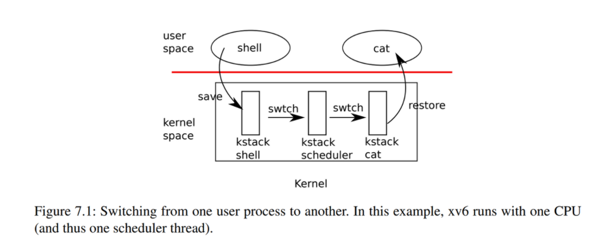

# Lab: Multithreading
本实验所用的代码在分支 thread
```
git checkout thread
```

## 课程笔记
****
### 多路复用
xv6 通过在两种情况下将每个 CPU 从一个进程切换到另一个进程来实现多路复用。第一，当进程等待设备或管道 I/O 完成，或者在`sleep`系统调用中等待是，xv6 使用睡眠和唤醒机制切换；第二，xv6 周期性地强制切换以处理长时间计算而不睡眠的进程。`sleep`允许一个进程放弃 CPU，`wakeup`允许另一个进程唤醒第一个进程。

这便是 CPU 虚拟化的实现，而 xv6 内存虚拟化是通过内存分配器和硬件页表来实现的。

### 代码：上下文切换
下图概述从一个用户进程(旧进程)切换到另一个用户进程(新进程)所涉及的步骤：  
1. 一个到旧进程内核线程的用户-内核转换(系统调用或中断)  
2. 一个到当前 CPU 调度程序线程的上下文切换  
3. 一个到新进程内核线程的上下文切换  
4. 一个返回到用户级进程  


xv6 调度程序在每个 CPU 上都有一个专用线程，函数`swtch`为内核线程切换执行保存和恢复寄存器集，这称为上下文。当某个进程要放弃 CPU 的时候，该进程的内核线程就会调用`swtch`来保存自己的上下文并返回到调度程序的上下文。每个上下文都包含在`struct contex`(__*kernel/proc.h:2*__)，这个结构体本身包含在一个进程的`struct proc`或者一个 CPU 的`struct proc`中。`swtch`接受两个参数：`struct context *old`和`struct context *new`。它将当前寄存器保存在`old`中，从`new`中加载寄存器，然后返回。  

中断结束时的一种可能性是`usertrap`调用了`yield`。依次地：`Yield`调用`sched`，`sched`调用`swtch`将当前上下文保存在`p->context`中，并切换到先前保存在`cpu->scheduler`（**_kernel/proc.c_**:517）中的调度程序上下文。  

`swtch`（**_kernel/swtch.S_**:3）只保存被调用方保存的寄存器（callee-saved registers）；调用方保存的寄存器（caller-saved registers）通过调用C代码保存在栈上（如果需要）。`swtch`知道`struct context`中每个寄存器字段的偏移量。它不保存程序计数器。但`swtch`保存`ra`寄存器，该寄存器保存调用`swtch`的返回地址。现在，`swtch`从新进程的上下文中恢复寄存器，该上下文保存前一个`swtch`保存的寄存器值。当`swtch`返回时，它返回到由`ra`寄存器指定的指令，即新线程以前调用`swtch`的指令。另外，它在新线程的栈上返回。  

```
Note
这里不太容易理解，这里举个课程视频中的例子：
**以`cc`切换到`ls`为例，且`ls`此前运行过**
1. XV6将`cc`程序的内核线程的内核寄存器保存在一个`context`对象中
2. 因为要切换到`ls`程序的内核线程，那么`ls` 程序现在的状态必然是`RUNABLE` ，表明`ls`程序之前运行了一半。这同时也意味着：
    a. `ls`程序的用户空间状态已经保存在了对应的trapframe中
    b. `ls`程序的内核线程对应的内核寄存器已经保存在对应的`context`对象中
    所以接下来，XV6会恢复`ls`程序的内核线程的`context`对象，也就是恢复内核线程的寄存器。
3. 之后`ls`会继续在它的内核线程栈上，完成它的中断处理程序
4. 恢复`ls`程序的trapframe中的用户进程状态，返回到用户空间的`ls`程序中
5. 最后恢复执行`ls`
```
`sched`调用`swtch`切换到`cpu->scheduler`，即每个CPU的调度程序上下文。调度程序上下文之前通过`scheduler`也调用`swtch`（**_kernel/proc.c_**:475）来进行了保存。当我们追踪`swtch`到返回时，他返回到`scheduler`而不是`sched`，并且它的栈指针指向当前CPU的调用程序栈(scheduler stack)。  

调度器（scheduler）以每个CPU上一个特殊线程的形式存在，每个 CPU 都运行`scheduler`函数。此函数负责选择下一个要运行的进程。想要放弃CPU的进程必须先获得自己的进程锁`p->lock`，并释放它持有的任何其他锁，更新自己的状态（`p->state`），然后调用`sched`。  

### 代码：调度
`scheduler`（**_kernel/proc.c_**:437）运行一个简单的循环：找到要运行的进程，运行它直到它让步，然后重复循环。`scheduler`在进程表上循环查找可运行的进程，该进程具有`p->state == RUNNABLE`。一旦找到一个进程，它将设置CPU当前进程变量`c->proc`，将该进程标记为`RUNINING`，然后调用`swtch`开始运行它（**_kernel/proc.c_**:475-492）。  
```C
// Per-CPU process scheduler.
// Each CPU calls scheduler() after setting itself up.
// Scheduler never returns.  It loops, doing:
//  - choose a process to run.
//  - swtch to start running that process.
//  - eventually that process transfers control
//    via swtch back to the scheduler.
void
scheduler(void)
{
  struct proc *p;
  struct cpu *c = mycpu();
  c->proc = 0;
  for(;;){
    // Avoid deadlock by ensuring that devices can interrupt.
    intr_on();

    for(p = proc; p < &proc[NPROC]; p++) {
      acquire(&p->lock);
      if(p->state == RUNNABLE) {
        // Switch to chosen process.  It is the process's job
        // to release its lock and then reacquire it
        // before jumping back to us.
        p->state = RUNNING;
        c->proc = p;
        swtch(&c->context, &p->context);
        // Process is done running for now.
        // It should have changed its p->state before coming back.
        c->proc = 0;
      }
      release(&p->lock);
    }
  }
}
```

### sleep与wakeup
xv6 使用`sleep`和`wakeup`的方法，允许一个进程在等待事件时休眠，而另一个进程在事件发生后将其唤醒，这称为条件同步机制。  

这一块其实与锁有很大的关系  

用信号量来协调生产者和消费者。信号量维护一个计数和两个操作，"V"操作增加计数，"P"操作等待计数为非零，然后递减返回。如果只有一个生产者和一个消费者线程，并且在不同的 CPU 上执行  
```c
struct semaphore
{
	struct spinlock lock;
	int count;
};

void V(struct semaphore* s)
{
	acquire(&s->lock);
	s->count += 1;
	release(&s->lock);
}

void P(struct semaphore* s)
{
	while(s->count == 0)
	;
	acquire(&s->lock);
	s->count -= 1;
	release(&s->lock);
}
```

但是上面的实现方法主要是效率太低。于是改用`sleep`和`wakeup`来实现 。`sleep(chan)`表示在任意值`chan`上睡眠，称为等待通道，`wakeup(chan)`唤醒在`chan`上睡眠的进程  
```c
void V(struct semaphore* s)
{
	acquire(s->lock);
	s->count += 1;
	wakeup(s);
	release(s->lock);
}

void P(struct semaphore* s)
{
	while(s->count==0)
		sleep(s);
	acquire(&s->lock);
	s->count -= 1;
	release(&s->lock);
}
```

上面的代码实现用休眠代替等待提高了代码效率，但是这样的实现方法是错误的。有可能`P`发现了信号量为0还没有进入休眠等待期间，`V`自增并调用`wakeup`，但是并没有通知到`P`，这样就会产生错误。出错的根本原因是`P`在`s->count`非零的时候进入睡眠，因此最简单的方案就是将获得锁的时机提前，但是单纯的提前将会造成死锁，`P`在获得锁之后进入休眠状态，因此需要修改为如下  
```c
void V(struct semaphore* s)
{
	acquire(&s->lock);
	s->count += 1;
	wakeup(s);
	release(&p->lock);
}

void P(struct semaphore* s)
{
	acquire(&s->lock);
	while(s->lock==0) sleep(s, &s->lock);// 要知道某一线程被唤醒之后也是先判断while是否成立，这也是争夺锁的过程
	s->count -= 1;
	release(&s->lock);
}
```

需要`sleep`释放锁并使得消费者进程进入睡眠状态的操作是原子的  

代码实现的基本思想是让`sleep`将当前进程标记为`SLEEPING`，然后调用`sched`释放CPU；`wakeup`查找在给定等待通道上休眠的进程，并将其标记为`RUNNABLE`。`sleep`和`wakeup`的调用者可以使用任何相互间方便的数字作为通道。Xv6通常使用等待过程中涉及的内核数据结构的地址。  

### 代码：Pipes
写入管道一端的字节被复制到内核缓冲区，然后可以从管道的另一端读取。  

每个管道都由一个`struct pipe`表示，其中包含一个锁`lock`和一个数据缓冲区`data`。字段`nread`和`nwrite`统计从缓冲区读取和写入缓冲区的总字节数。缓冲区是环形的：在`buf[PIPESIZE-1]`之后写入的下一个字节是`buf[0]`。而计数不是环形。此约定允许实现区分完整缓冲区（`nwrite==nread+PIPESIZE`）和空缓冲区（`nwrite==nread`），但这意味着对缓冲区的索引必须使用`buf[nread%PIPESIZE]`，而不仅仅是`buf[nread]`  

### 代码：wait exit kill
`Wait`使用调用进程的`p->lock`作为条件锁，以避免丢失唤醒，并在开始时获取该锁（**_kernel/proc.c_**:398）。然后它扫描进程表。如果它使用`p->parent`去获得子进程，并发现一个子进程处于`ZOMBIE`状态，它将释放该子进程的资源及其`proc`结构体，将该子进程的退出状态码复制到提供给`wait`的地址（如果不是0），并返回该子进程的进程ID。如果`wait`找到子进程但没有子进程退出，它将调用`sleep`以等待其中一个退出。  

`Exit`（**_kernel/proc.c_**:333）记录退出状态码，释放一些资源，将所有子进程提供给`init`进程，在父进程处于等待状态时唤醒父进程，将调用方标记为僵尸进程（zombie），并永久地让出CPU。  

`exit`允许进程自行终止，而`kill`（**_kernel/proc.c_**:611）允许一个进程请求另一个进程终止。它只是设置受害者的`p->killed`，如果它正在睡眠，则唤醒它。  
## Uthread：switching between threads
****
本实验将为用户级线程系统设计上下文机制，xv6 中有两个文件`user/uthread.c`和`user/uthread_switch.S`  

`uthread.c`文件是如下的，`main`函数就是第一个线程，并在函数中运行`thread_schedule`实现对用户级线程的调度，`thread_create`是初始化一个用户级线程，主要是对一个`thread`结构体赋值。  
```c
struct thread {
  char       stack[STACK_SIZE]; /* the thread's stack */
  int        state;             /* FREE, RUNNING, RUNNABLE */
};

int
main(int argc, char *argv[])
{
  a_started = b_started = c_started = 0;
  a_n = b_n = c_n = 0;
  thread_init();
  thread_create(thread_a);
  thread_create(thread_b);
  thread_create(thread_c);
  thread_schedule();
  exit(0);
}

void
thread_init(void)
{
  current_thread = &all_thread[0];
  current_thread->state = RUNNING;
}
```

注意点：  
1. 在结构体中新建一个数据结构以保存上下文  
2. 记住栈指针是从高地址到低地址的，`sp`的赋值为高地址  
3. 在`thread_creat`中完成对用户级线程的初始化  

代码的具体实现可以查看 commit 记录 完成用户级线程切换  
## Using threads
****
本实验的任务是在哈希表中使用线程和锁来完成并行编程。

哈希表的简单实现已经在(__*notxv6/ph.c*__)中，可以通过以下指令来实现，`ph`命令的参数代表线程数量
```
make ph
./ph 1
```

该函数已经实现了`get` `put` `insert`操作，本lab只需要对写操作进行加锁即可。也就是只要对`put`函数下的赋值操作加上互斥锁。  

代码的具体实现可以查看 commit 记录 完成 Using threads  
## Barrier
****
本实验要求实现同步屏障，同步屏障是并行计算当中的一种同步方法，对于一群进程或者线程，程序中的一个同步屏障意味着任何的线程/进程执行到此后必须等待，直到所有线程/进程都到达此点才可以继续执行下文。 思路：一个线程到达屏障后就将一个变量+1，最后如果这个变量等于线程总数量再继续向下执行。再变量到达总数之前需要让线程阻塞在屏障的位置，可以采用互斥锁加上轮询的方式来实现，但是这样的方法对性能的损耗太大；转而采用条件变量的方法，也就是说与其让每一个线程去轮询，为什么不让最后一个到达的线程去通知其他线程呢？  

注意：  
pthread_cond_wait(&cond, &mutex)按照顺序完成了下面的3件事：  
1. pthread_mutex_unlock(&mutex)  
2. 把线程放入等待条件的线程列表中  
3. 阻塞线程（直到别的线程发送信号）  
其中1，2操作是原子操作  

`barrier`的简单实现已经在(__*notxv6/barrier.c*__)中，可以通过以下指令来实现，`ph`命令的参数代表线程数量  
```
make barrier
./barrier 2
```

代码的具体实现可以查看 commit 记录 完成 barrier   