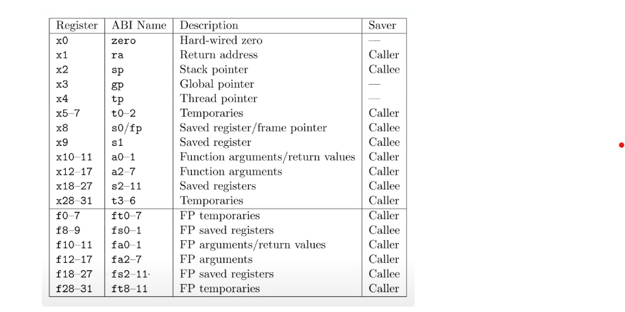
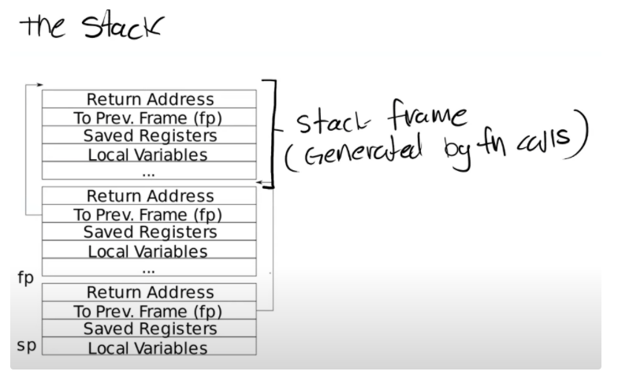

# Lab: traps
****
本实验所用的代码在分支 traps
```
git checkout traps
```

## 课程笔记
****
### 陷阱指令和系统调用
有三种事件会导致中央处理器搁置普通指令的执行，并强制将控制权转移到处理该事件的特殊代码上。  
	1. 系统调用，执行`ecall`指令  
	2. 异常：(用户或者内核)指令做了一些非法的事，例如除零或访问无效地址  
	3. 设备中断  

为了让`trap`处理程序更加方便，分别针对三种不同的情况：来自用户空间的trap、来自内核空间的trap和定时器中断进入不同的处理函数
### RISC-V陷入机制
RISC-V CPU都有一组控制寄存器，内核通过向这些寄存器写入内容来告诉 CPU 如何处理陷阱。(**_kernel/riscv.h_**)包含了在 xv6 中使用到的内容的定义，以下是最重要的寄存器的概述：  
	1. `stvec` :内核在这里写入其陷阱处理程序的地址；RISC-V跳转到这里处理陷阱  
	2. `sepc`:当发生陷阱时，RISC-V会在这里保存程序计数器 pc(因为 pc 会被 stvec 覆盖)。`sret`指令会将`sepc`复制到`pc`。内核可以写入`sepc`来控制`sret`的去向  
	3. `scause`:RISC-V 在这里放置一个描述陷阱原因的数字  
	4. `sscratch`:保存trapframe page的虚拟地址  
	5. `sstatus`:其中 `SIE` 位控制设备中断是否启用。如果内核清空`SIE`，将推迟设备中断直到内核重新设置`SIE`。`SPP`位指示陷阱是来自用户模式还是管理模式，并控制`sret`返回的模式  

当强制执行陷阱时，RISC-V 硬件对所有陷阱类型(计时器中断除外)执行以下操作：  
	1. 如果陷阱时设备中断，并且状态位 `SIE` 被清空，则不执行以下任何操作  
	2. 清除`SIE`以禁用中断   
	3. 将`pc`复制到`sepc`  
	4. 将当前模式(用户或者管理)保存在状态位`SPP`上  
	5. 设置`scause`以反映产生陷阱的原因  
	6. 将模式设置为管理模式  
	7. 将`stvec`复制到`pc`  
	8. 在新的`pc`上开始执行  

注意这里 CPU 不会切换到内核页表，不会切换到内核栈，也不会保存除了 pc 以外的其他寄存器，这些都需要内核软件来执行。  

### 从用户空间陷入

如果在用户空间发出系统调用`ecall`指令，或者做了非法的事，或者设备中断，那么在用户空间就会发生陷入。用户空间发生陷入的路径 `uservec` (**_kernel/trampoline.S_**:16)，然后是 `usertrap` (kernel/trap.c:37)；返回的时候，先是 `usertrapret` (kernel/trap.c:90)，然后是 `userret` (kernel/trampoline:16)

根据代码详细记录一下 xv6 陷入的过程  

1. 在用户态发起系统调用之后将会调用相应的 **_用户跳板函数_**   
2. 跳板函数将系统调用号存入 a7 寄存器，执行 `ecall` 指令  
	1.1 `ecall` 指令完成了上述提到的8个过程，现在的 pc 指向原 stvec 指向的地址，也就是 `uservec` ，由汇编编写  
3. `trampoline` 中的 `uservec` 函数。这里先记录一下 `trampoline.S`，这部分的代码被映射到用户空间和内核空间相同的虚拟地址上。该函数主要完成`ecall`指令后硬件未完成的事：1）切换成内核栈 2）切换为内核页表 3）保护现场(主要是32个用户寄存器)  
	3.1 **_记住这里虽然已经是管理模式，但依旧采用的是用户页表，所以可以直接访问保存进程 trapframe 页的资源。_**  首先交换 a0 和  sscratch 寄存器的值(注意：sscratch 保存的是 trapframe page 的虚拟地址)  
	3.2 根据 a0 提供的虚拟地址将用户寄存器保存在 trapframe page  
	3.3 在 trapframe page，除了要向里面存储当前的用户寄存器值，还保存一些 trap 所需要的值，现在要将其加载出来。比如 **_内核的satp(内核根页表的物理地址)，内核的 stack pointer ，内核陷入地址(也就是接下来 usertrap 函数的地址)，保存用户程序的pc，保存当前进程所使用的cpu。_** 其具体的实现是将 a0 指向地址向后8个字节的地址的值存入 sp，指向内核栈；将 a0 指向地址向后16个字节的地址的值存入 t0，指向下一个处理函数，接下来将直接调用指令跳转过去；将 a0 指向的地址的值存入 t1，然后交换 t1 和 satp 的值，指向内核跟页表的物理地址  
	3.4 跳转到 t0 指向地址函数开始执行  
4. `usertrap` 函数主要完成在进入 `syscall` 之前的一些业务逻辑处理：切换`stvec`，保存`sepc`，判断是否是系统调用，使能中断等，具体步骤如下：  
   4.1 检查`sstatus`寄存器的`SPP`位，判断是否是来自用户模式  
   4.2 现在已经是内核态了，如果这个时候发生了异常和中断，那将是另一种处理逻辑了(比如由于已经在内核是不需要保护现场了)，因此需要重新设置`svtec`寄存器，从`trapframe page`取出内核陷入处理函数的地址交给`stvec`  
   4.3 检查`scause`寄存器的值来判断是否是系统调用  
   4.4 取出`sepc`的值保存到`trapframe page`，并需要自加4，以指向下一条指令  
   4.5 调用`syscall`函数  
5. `syscall`主要完成以下步骤  
	5.1 从`trapframe`中取出a7寄存器的值，根据系统调用号索引相应的函数  
	5.2 用寄存器a0接收相应的返回值  
6. `usertrapret`位于(**_kernel/trap.c_**)，需要设置完成返回用户空间之前内核要做的工作，注意这边有误，内核页表无法访问`trapframe page`，是从`pcb`中读出  
	6.1 关闭中断(这是因为接下来要设置`stvec`寄存器指向用户空间的`trap`处理代码，但是仍然处于内核中，如果此时发生中断将会走向用户的陷入处理函数)  
	6.2 设置`stvec`寄存器指向`trampoline`代码  
	6.3 将陷入所需的内容填入`trapframe page`:1)内核页表指针 2)存储当前用户进程的内核栈 3)存储`usertrap`函数的指针，方便下次跳转 4)从`tp`寄存器中读取当前的 CPU 核编号，并存在`trapframe page`中  
	6.4 设置`sstatus`寄存器的值  
	6.5 从`trapframe page`中取出`sepc`的值放入`sepc`寄存器  
	6.6 将`trapframe page`地址和`satp`作为参数传给`userret`函数  
7. `userret`函数位于(__*kernel/trampoline.S*__)，汇编完成。主要完成1)切换页表 2)切换栈 3)恢复现场  
	7.1 交换`satp`和`a1`的值，那么从现在开始切换位用户页表，同样可以访问`trampoline page`  
	7.2 将`trapframe page`存入`sscratch`  
	7.3 将之前保存的用户寄存器的值加载回用户寄存器  
	7.4 调用`sret`，主要完成3件事 1)切换回用户模式 2)`sepc`寄存器的值拷贝到`pc` 3)使能中断  


### RISC-V 寄存器
RISC-V 寄存器如下，汇编代码并不是在内存上执行，而是在寄存器上执行。

a0到a7寄存器用来作为函数的参数，如果函数有超过8个参数就需要内存了。

两种类型的寄存器，Caller Saved寄存器在函数调用的时候不会自动保存(由调用者负责保存这组寄存器)，Callee Saved寄存器在函数调用的时候会自动保存(由被调用者负责保存这组寄存器的)


下面是一张简单的栈的结构图，每个区域都是一个`stack frame`，每执行一次函数调用都会产生一个`stack frame`。每次调用一个函数，函数都会为自己创建一个`stack frame`，包含了保存的寄存器，本地变量并且如果函数参数如果多与8个，额外的参数会出现在`stack`中。有两个值的位置是固定的 1)`Return address`总是出现在`stack frame`的第一位 2)指向前一个`stack frame`的指针出现在栈中的固定位置。

有关`stack frame`中有两个重要的寄存器，第一个是`sp`，它指向`stack`的底部并代表了当前`stack frame`的位置；第二个是`fp`，指向当前`stack frame`的顶部


### RISC-V GDB 调试
在一个窗口执行`make qemu-gdb`

在另一个窗口执行
```bash
gdb-multiarch kernel/kernel

# 进入gdb后执行
set architecture riscv:rv64
target remote lcoalhost:xxx
```

如果要调试用户态下的程序，需要
```
file user/_call
```

tui enable: 打开源代码展示窗口  
layout asm：在tui窗口看到所有的汇编指令  
layout reg：所有寄存器信息  
info breakpoint：查看断点信息（可以查看命中了几次）  
info reg  
info frame：查看当前stack frame  
backtrace：可以看到当前调用栈开始的所有stack frame  

frame N：切换到栈编号为N的上下文中  
info frame：查看当前函数调用的栈帧信息  

info r：查看当前寄存器的值  
info args：查看当前函数参数的值  
info locals：查看当前局部变量的值  
info variables：查看程序中的变量符号  
info function：查看程序中的函数符号  

backtrace：查看当前栈中的函数调用  
x/i：输入一个指令地址，可以显示的输出代码的具体位置  
x/g：具体查看GDB的x指令，专门查询内存  
## Backtrace
****
对于调试来说，有一个回溯通常很有用：在发生错误的点之上的堆栈的函数调用列表。

编译器在每一个堆栈帧中放入一个帧指针，该指针保存调用方的帧指针的地址。回溯应该使用这些帧指针遍历堆栈，并在每个堆栈帧中打印保存的返回地址。

注意：
	1. 在(**_kernel/defs.h_**)中增加对`backtrace`的声明  
	2. xv6 在与 page 对齐的地址为 xv6 内核中的每个堆栈分配一个页面，可以使用`PAGOUNDOMN(fp)`和`PAGOUNDUP(fp)`。  
	3. GCC编译器将当前执行的函数的帧指针存储在寄存器s0/fp中。将以下函数添加到kernel/rescv.h中；并在backtrace中调用此函数来读取当前帧指针。此函数使用内联函数读取s0。  
```c
static inline uint64
r_fp()
{
  uint64 x;
  asm volatile("mv %0, s0" : "=r" (x) );
  return x;
}
```

代码的具体实现可以查看 commit 记录 完成 backtrace

## Alarm
****
在本实验中将向 xv6 添加1个功能，该功能在进程使用 CPU 时间定期提醒进程。实现用户级中断/故障处理程序的原始形式。

添加一个新的 `sigalarm(interval, handler)`的系统调用。如果应用程序调用`sigalarm(n,fn)`，那么在程序消耗的 CPU 时间为n个`ticks`后，内核应该调用应用程序`fn`。当`fn`返回时，应用程序应该从停止的地方恢复。如果应用程序调用`sigalarm(0, 0)`，内核应该停止该警报。

`sigalarm`在应用层的调用已经实现，要求内核每隔2个周期强制调用`periodic`
```c
sigalarm(2, periodic);

void
periodic()
{
  count = count + 1;
  printf("alarm!\n");
  sigreturn();
}
```

注意：  
	1. 在(**_kernel/trap.c_**)中`usertrap`函数调用`devintr()`，该函数检查是外部中断还是软件中断，若返回2便是时间中断，若返回1则来自其他设备，若返回0则表示未识别  
	2. 在`usertrap`中判断周期是否到达，若到达直接修改`p->trapframe`的`epc`，在现场恢复的时候真正的寄存器会读取这个值然后返回相应的地址(**_系统调用和普通的函数调用逻辑是一样的，将函数返回地址存在一个地方，等到返回的时候寄存器取出该值_**)  
	3. `sigalarm`函数主要是对`proc`新增变量进行赋值  
	4. `sigreturn`函数调用之后就是将之前保存的`epc`再放回`p->trapframe->epc`  
	5. 完成到这一步之后依旧会有问题，这主要是没有考虑到`trapframe`中的其他值可能会发生变化，所以需要模仿`trapframe`在新的内存空间中存储当时的现场

代码的具体实现可以查看 commit 记录 多条与 Alarm 相关记录