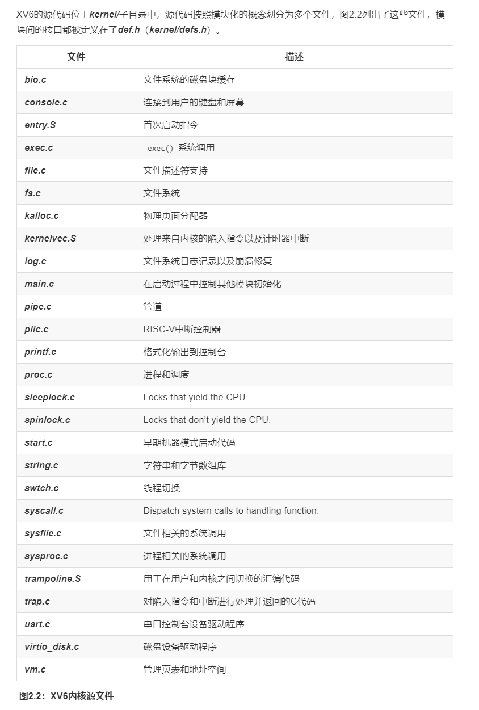
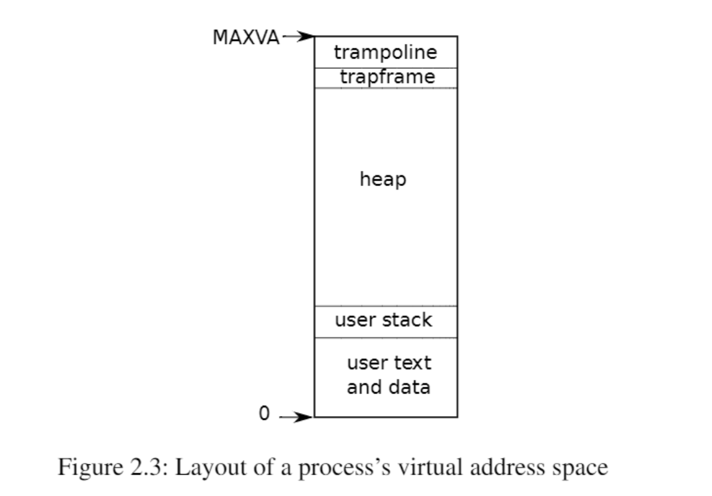

# Lab: system calls
****
本实验所用的代码在分支 syscall 
```
git checkout syscall
```

## 课程笔记
****
### 操作系统架构
CPU 为强隔离提供硬件支持，RISV-V 有三种 CPU 可以执行指令的模式：机器模式，用户模式和管理模式。在机器模式下执行的指令具有完全的特权；CPU 在机器模式下启动。xv6 在机器模式下执行很少的代码，然后更改为管理模式。

在管理模式下，CPU 被允许执行特权指令：例如启用和禁用中断、读取和写入保护页表地址的寄存器等。

想要调用内核函数的应用程序，必须过渡到内核。CPU 提供一个特殊的指令将 CPU 从用户模式切换到管理模式，并在**内核指定的入口点**进入内核( RISC-V 为此提供了 ecall 指令)。一旦 CPU 切换到管理模式，内核就可以验证系统调用的参数，决定是否允许应用程序执行的操作。

xv6 操作系统源代码


### 进程概述
xv6 使用页表(由硬件实现)为每个进程提供自己的地址空间。RISC-V 页表将虚拟地址映射为物理地址。RISC-V 上的指针有64位宽，硬件在页表中查找虚拟地址时只使用低39位，xv6 只使用其中的38位。因此，最大地址是 $2^{38}-1$=0x3fffffffff$，即 MAXVA ，在[kernel/riscv.h]() 中定义。在地址空间的顶部，xv6 为 trampoline(用于在用户和内核切换)和映射进程切换到内核的 trapframe 分别保留一个页面。


xv6 内核为每个进程维护许多状态片段，并保存在 proc [kernel/proc.h:86]() 结构体中。一个进程最重要的内核状态片段是它的页表、内核栈区和运行状态。可以使用符号 p->xxx 来引用结构体的元素，例如，p->pagetable 是一个指向该进程页表的指针。

每个进程都有一个执行线程来执行进程的指令，为了透明地在进程之间切换，内核挂起当前运行的线程，并恢复另一个进程的线程。线程的大部分状态：本地变量、函数调用返回地址等都存储在线程的栈区上。每个进程有两个栈区，一个用户栈区和一个内核栈区(p->kstack)。当进程执行用户指令的时候，只有用户栈在使用，内核栈是空的。

一个进程可以通过执行 RISC-V 的 ecall 指令进行系统调用，该指令可以提升硬件特权级别，并将程序计数器 PC 更改为内核定义的入口点，入口点的代码切换到内核栈，执行实现系统调用的内核指令。系统调用完成时，内核切换回用户栈，并通过调用 sret 指令返回用户空间，降低了特权等级。

### 系统调用过程总结说明
实现系统调用注意点如下：  
	 1. 在用户态下调用一个系统调用函数，在[user/user.h]()中申明  
	 2. 调用系统调用函数后会跳转到汇编文件[user/usys.S]()，这个文件定义了每个系统调用函数的**用户跳板函数**，由[user/usys.pl]()编译得到  
	 3. 用户跳板函数会将系统调用号(在[kernel/syscall.h]()中定义)存入 a7 寄存器，进入内核态  
	 4. ecall 指令会跳转到内核定义的函数入口，[kernel/syscall.c]()中的 syscall 函数  
	 5. syscall 函数会读取 a7 寄存器上的系统调用号，查询存储着函数指针的数组，跳转到相应的函数  

## System call tracing
本实验的目的在于添加一个系统调用跟踪功能。该函数位于[kernel/sysproc.c]()。它接收一个输入参数，是一个指定要跟踪的系统调用的掩码，在每个系统调用即将返回时打印出一行，该行应包含进程id、系统调用的名称以及返回值。

注意点：  
	1. 向 user/user.h 添加系统调用的原型  
	2. 向 user/usys.pl 添加存根，通过 Makefile 生成 user/usys.S，这是实际的系统调用存根  
	3. 需要在 fork 函数中子进程拷贝父进程的pcb中新增的变量：tracemask  
	4. 如果要去 trace fork，则输入 trace(1<<SYS_fork)  

在[user/usys.pl]()增加一项
```
entry("trace");
```
编译之后就会在[user/usys.S]()得到一串汇编函数
```
.global trace
	trace：					# 定义用户跳板函数
	li a7, SYS_trace		# 将系统调用号（syscall.h中声明）传给a7寄存器
	ecall					# 执行ecall进入内核态
	ret						# 返回用户态
```
trace 函数在用户层已经实现好了，其在命令行的调用方法是
```
trace 2147483647 grep hello README  // 2147483647 指的是所有系统调用
```
其函数是
```c
int
main(int argc, char *argv[])
{
  int i;
  char *nargv[MAXARG];

  if(argc < 3 || (argv[1][0] < '0' || argv[1][0] > '9')){
    fprintf(2, "Usage: %s mask command\n", argv[0]);
    exit(1);
  }

  if (trace(atoi(argv[1])) < 0) {
    fprintf(2, "%s: trace failed\n", argv[0]);
    exit(1);
  }
  
  for(i = 2; i < argc && i < MAXARG; i++){
    nargv[i-2] = argv[i];
  }

  exec(nargv[0], nargv);
  exit(0);
}
```
代码的具体实现可以查看 commit 多条记录(未记录 sysinfo 的commit)
## Sysinfo
本实验的需要添加一个系统调用来收集正在运行的系统信息。该系统调用接受一个参数：指向结构体 sysinfo 的指针[kernel/sysinfo.h]。内核应该填写此结构体的字段：空闲内存的字节数量和空闲状态下的进程数量。

注意点：  
	1. 结构体 sysinfo 同样需要在用户层中定义  
	2. 在内核中获取的系统信息需要传递到用户态，参考 sys_fstat 函数，使用 copyout  
	3. 在[kernel/kalloc.c](中实现一个 **acquire_freemem()，全局参数 kmem 保存了一个空闲链表，每个链表为一页，一页为4096 byte，所以只需要遍历该链表就可以获得空闲的字节数  
	4. 在[kernel/proc.c] 中实现一个 acquire_nproc，在文件当中维护了一个保存结构体 proc 的全局数组 proc，通过遍历这个 proc 就能知道未使用中的进程数量  

代码的具体实现可以查看 commit 多条记录(记录 sysinfo 的commit)