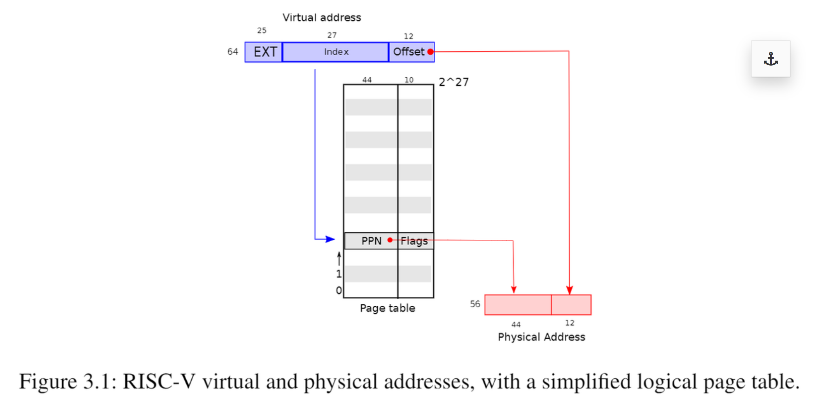
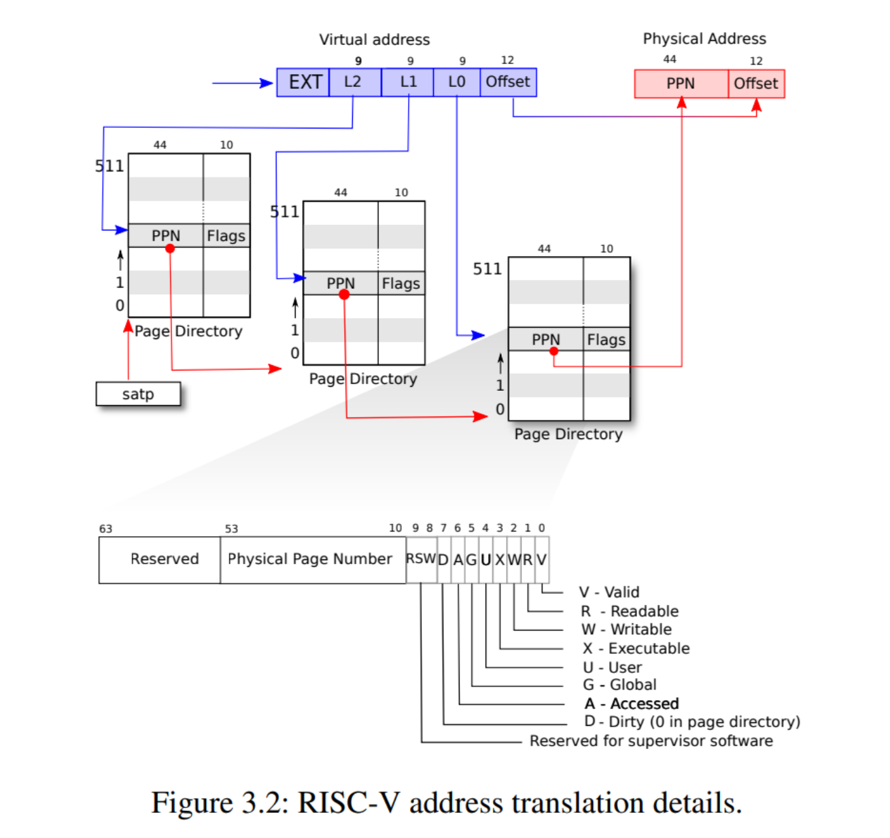
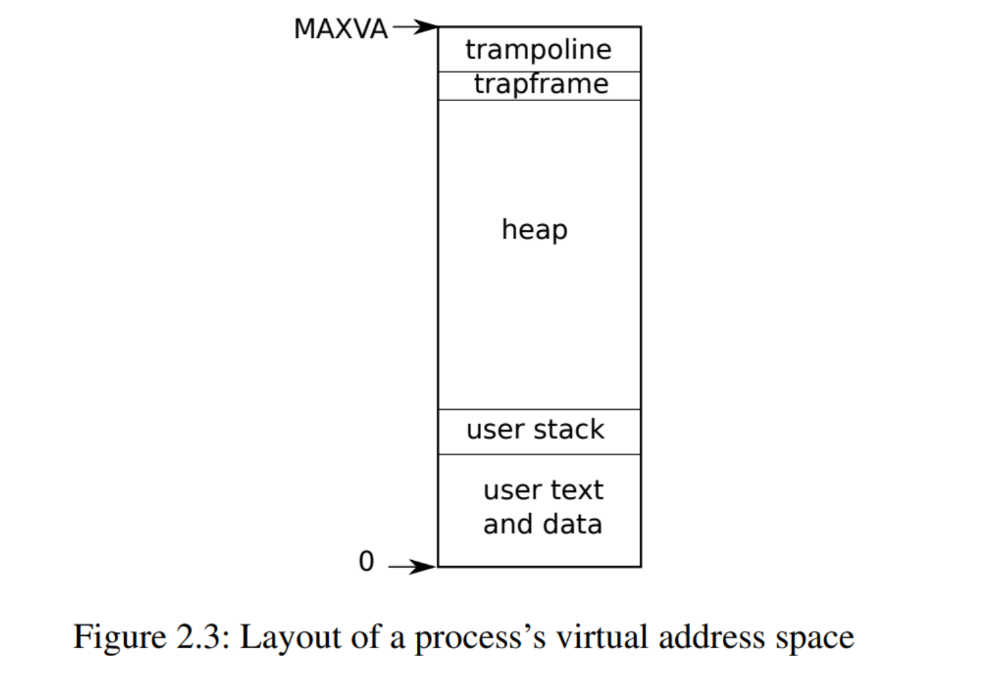
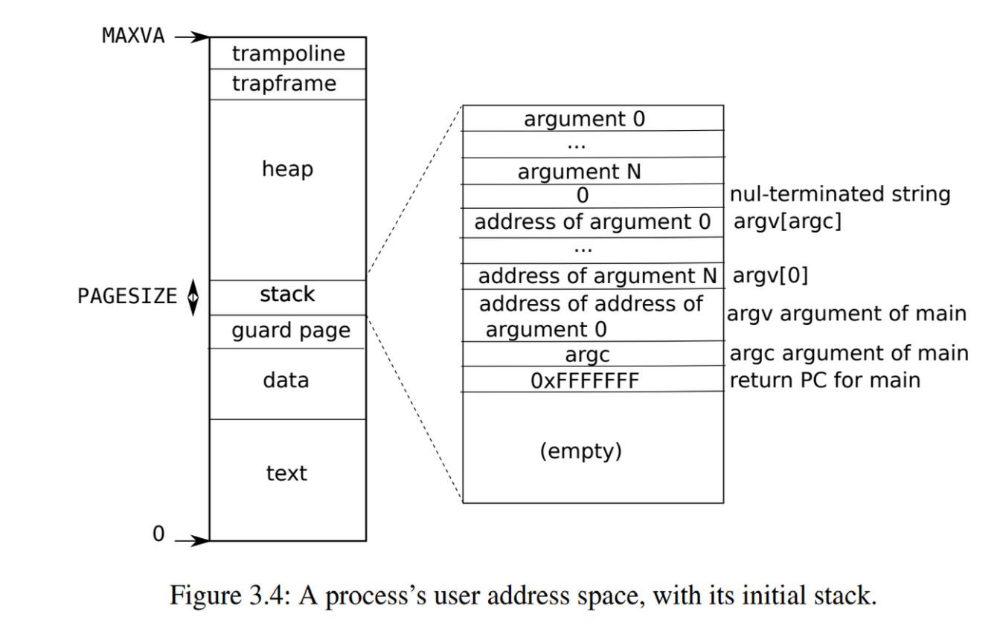

# Lab: page tables
****
本实验所用的代码在分支 pgtbl
```
git checkout pgtbl
```

## 课程笔记
****
### 页表
页表是操作系统为每个进程提供私有地址空间和内存的机制。页表决定了内存地址的含义，以及物理地址哪些部分是可以访问的。并且支持一些特殊的操作：映射相同的内存到不同的地址空间(trampoline page)，还可以用一个未映射的页面保护内核和用户栈区

xv6 基于 Sv39 RISC-V 运行，这意味着它使用64位虚拟地址的低39位，而高25位不使用。$2^{39}$使得该系统虚拟内存拥有512g。在这种配置下，RISC-V 页表在逻辑上是一个由 $2^{27}$ 个页表条目(Page Table Entries/PTE)组成的数组，每个 PTE 包含一个44位的物理页码(Physical Page Number/PPN)和一些标志。

分页硬件通过虚拟地址39位中前27位索引页表，这对应页表条目数量，找到该虚拟地址对应的一个PTE，然后生成一个56位的物理地址，也就是物理内存大小为$2^{56}$，其中前44位来自PTE中的PPN，12位来自原始虚拟地址。也正因为如此，页表能使操作系统以 4096($2^{12}$) 字节的对齐块的粒度控制虚拟地址到物理地址的转换，这样的块称为页。


### 多级页表
在 xv6 真实的操作系统，虚拟地址向物理地址的转换其实是分三个步骤进行的。页表以三级的树型结构存储在物理内存中。该树的根是一个4096字节的页表页，(注意这是存储在一个物理地址下的)，其中包含512个 PTE(每个 PTE 占8个字节)，分支硬件使用27位中的前9位在根页表页面寻址，中间9位在树的下一级页表页面中选择 PTE，最后9位选择最终的 PTE。


如果转换地址过程所需的三个 PTE 任何一个不存在，页式硬件就会引发 page fault。  

这样的设计方式的目的是为了节省内存，只需要加载所需的 PTE 对应的页表即可。但这样带来的缺点是寻址一个虚拟地址必须三次从物理内存中加载 PTE，为了减少这一开销，cpu将页表条目缓存在 TLB 当中。  

每个PTE包含标志位，这些标志位告诉分页硬件允许如何使用关联的虚拟地址。`PTE_V`指示PTE是否存在：如果它没有被设置，对页面的引用会导致异常（即不允许）。`PTE_R`控制是否允许指令读取到页面。`PTE_W`控制是否允许指令写入到页面。`PTE_X`控制CPU是否可以将页面内容解释为指令并执行它们。`PTE_U`控制用户模式下的指令是否被允许访问页面；如果没有设置`PTE_U`，PTE只能在管理模式下使用。标志和所有其他与页面硬件相关的结构在（**_kernel/riscv.h_**）中定义。  

为了告诉硬件使用页表，内核必须将根页表页的物理地址写入到`satp`寄存器中（`satp`的作用是存放根页表页在物理内存中的地址）。每个CPU都有自己的`satp`，一个CPU将使用自己的`satp`指向的页表转换后续指令生成的所有地址。每个CPU都有自己的`satp`，因此不同的CPU就可以运行不同的进程，每个进程都有自己的页表描述的私有地址空间。  

由于页目录位于物理内存中，内核可以通过使用标准存储指令写入 PTE 的虚拟地址来对页目录中的 PTE 内容进行编程。

### 内核地址空间
xv6 为每一个进程维护一个页表，用以维护每个进程的用户地址空间，另外还有一个单独描述内核地址空间的页表。内核虚拟地址到物理地址的映射如下图，文件(**_kernle/memlayout.h_**) 声明了xv6内核内存布局的常量。

QMEU 模拟的计算机，包括了从物理地址 `0x80000000` 开始并至少到 `0x86400000` 结束的 RAM(物理内存)，xv6 称结束地址为 `PHYSTOP`。QMEU 将设备接口如磁盘接口、IO设备作为内存映射控制寄存器暴露给软件，这些寄存器位于物理地址 `0x80000000` 之下。内核可以通过读取/写入这些特殊的物理地址与设备交互。

内核使用*直接映射*的方式获取内存和内存映射设备寄存器，也就是说将资源映射到等于物理地址的虚拟地址。直接映射简化了读取或写入物理内存的内核代码。比如，当父进程调用 `fork` 为子进程分配用户内存时，分配器返回该内存的物理地址，在将父进程的用户内存拷贝到子进程的时候直接将该地址用作虚拟地址。

有几个内核虚拟地址不是直接映射的：  
	1. trampoline，它映射是在虚拟地址空间的顶部，注意它在用户页表具有相同的映射。另外要注意的是一个物理页面(持有 trampoline 代码)在内核虚拟地址空间当中映射了两次：一次在虚拟地址空间顶部，一次是直接映射。  
	2. 内核栈页面。每个进程都有自己的内核栈，映射到一个偏高的地址，并在它的下面留下了一个未映射的保护页(guard page)，其 `PTE_V` 是没有被设置的，也就是说栈溢出将会引发页中断。并且 guard page 并不会消耗物理内存。 

内核在权限 `PTE_R` 和 `PTE_X` 下映射蹦床页面和内核文本页面，可以读取和执行。在权限 `PTE_R` 和 `PTE_W` 下映射其他页面，可以读写。  

### 代码：创建一个地址空间

大多数用于操作地址空间和页表的xv6代码都写在 **_vm.c_** 中。其核心数据结构是`pagetable_t`，它实际上是指向RISC-V根页表页的指针；一个`pagetable_t`可以是内核页表，也可以是一个进程页表。最核心的函数是`walk`和`mappages`，前者为虚拟地址找到PTE，后者为新映射装载PTE。名称以`kvm`开头的函数操作内核页表；以`uvm`开头的函数操作用户页表；其他函数用于二者。`copyout`和`copyin`复制数据到用户虚拟地址或从用户虚拟地址复制数据，这些虚拟地址作为系统调用参数提供; 由于它们需要显式地翻译这些地址，以便找到相应的物理内存，故将它们写在 **_vm.c_** 中。

在启动序列的前期，该操作发生在物理内存已经分配完成后，`main` 调用 `kvminit` 以创建内核进程的页表，`kvminit` 整个函数就是调用 `kvmake` ，并接收内核页表的地址。此调用发生在 xv6 启用 RISC-V 上的分页之前，因此地址直接使用物理地址。

`kvmmake` 执行的步骤如下：  
	1. 分配一个物理页面来保存根页表  
	2. 调用 `kvmmap` 装载内核所需要的转换，转换包括设备的内存、内核指令和数据、物理内存的上限到 `PHYSTOP` ,以及 trampoline  
		1. `kvmmap` 调用 `mappage` 将范围虚拟地址到同等范围物理地址映射装载到一个页表上。对于要映射的每个虚拟地址调用 `walk` 来查找该地址的 PTE 地址，然后设置相关物理页号以及权限设置    
	3. 调用 `Proc_mapstack` 为每一个进程分配一个内核堆栈。调用 `kvmmap` 将每个堆栈映射到由 `KSTACK` 生成的虚拟地址，为无效的堆栈保护页面留出空间  （注意 xv6 这里是将所有的进程的内核栈都已经先分配完成了）  

在查找PTE时，`walk`(**_kernel/vm.c_**:72)模仿RISC-V分页硬件。`walk`一次从3级页表中获取9个比特位。它使用上一级的9位虚拟地址来查找下一级页表或最终页面的PTE (**_kernel/vm.c_**:78)。如果PTE无效，则所需的页面还没有分配；如果设置了`alloc`参数，`walk`就会分配一个新的页表页面，并将其物理地址放在PTE中。它返回树中最低一级的PTE地址(**_kernel/vm.c_**:88)。  

上面的代码依赖于直接映射到内核虚拟地址空间中的物理内存。例如，当`walk`降低页表的级别时，它从PTE (**_kernel/vm.c_**:80)中提取下一级页表的（物理）地址，然后使用该地址作为虚拟地址来获取下一级的PTE (**_kernel/vm.c_**:78)。

`main`调用`kvminithart` (**_kernel/vm.c_**:53)来安装内核页表。它将根页表页的物理地址写入寄存器`satp`。之后，CPU将使用内核页表转换地址。由于内核使用标识映射，下一条指令的当前虚拟地址将映射到正确的物理内存地址。

`main`中调用的`procinit` (**_kernel/proc.c_**:26)为每个进程分配一个内核栈。其实进程的内核栈已经分配完成了，这里是将内核栈地址存入每个进程的`PCB`控制块中。

每个RISC-V CPU都将页表条目缓存在转译后备缓冲器（快表/TLB）中，当xv6更改页表时，它必须告诉CPU使相应的缓存TLB条目无效。如果没有这么做，那么在某个时候TLB可能会使用旧的缓存映射，指向一个在此期间已分配给另一个进程的物理页面，这样会导致一个进程可能能够在其他进程的内存上涂鸦。RISC-V有一个指令`sfence.vma`，用于刷新当前CPU的TLB。xv6在重新加载`satp`寄存器后，在`kvminithart`中执行`sfence.vma`，并在返回用户空间之前在用于切换至一个用户页表的`trampoline`代码中执行`sfence.vma` (**_kernel/trampoline.S_**:79)。

### 物理内存分配代码
xv6 使用内核末尾到 PHYSTOP 之间的物理内存进行运行时分配，一次分配和释放整个4096字节的页面。使用链表将空闲页面记录下来。分配时需要从链表中删除页面；释放时需要将释放的页面添加到链表中，注意空闲链表当中保存的是物理地址。

分配器的数据结构是可供分配的物理内存页的空闲列表。每个空闲页的列表元素是一个`struct run`(**_kernel/kalloc.c_**:17)。它将每个空闲页的`run`结构存储在空闲页本身，因为在那里没有存储其他东西。空闲列表受到自旋锁（spin lock）的保护(**_kernel/kalloc.c_**:21-24)。列表和锁被封装在一个结构体中，以明确锁在结构体中保护的字段。

`main`函数调用`kinit`(**_kernel/kalloc.c_**:27)来初始化分配器。`kinit`初始化空闲列表以保存从内核结束到`PHYSTOP`之间的每一页。xv6应该通过解析硬件提供的配置信息来确定有多少物理内存可用。然而，xv6假设机器有128兆字节的RAM。`kinit`调用`freerange`将内存添加到空闲列表中，在`freerange`中每页都会调用`kfree`。PTE只能引用在4096字节边界上对齐的物理地址（是4096的倍数），所以`freerange`使用`PGROUNDUP`来确保它只释放对齐的物理地址。分配器开始时没有内存；这些对`kfree`的调用给了它一些管理空间。

分配器有时将地址视为整数，以便对其执行算术运算（例如，在`freerange`中遍历所有页面），有时将地址用作读写内存的指针（例如，操纵存储在每个页面中的`run`结构）；这种地址的双重用途是分配器代码充满C类型转换的主要原因。另一个原因是释放和分配从本质上改变了内存的类型。

函数`kfree` (**_kernel/kalloc.c_**:47)首先将内存中的每一个字节设置为1。这将导致使用释放后的内存的代码（使用“悬空引用”）读取到垃圾信息而不是旧的有效内容，从而希望这样的代码更快崩溃。然后`kfree`将页面前置（头插法）到空闲列表中：它将`pa`转换为一个指向`struct run`的指针`r`，在`r->next`中记录空闲列表的旧开始，并将空闲列表设置为等于`r`。

`kalloc`删除并返回空闲列表中的第一个元素。

### 进程地址空间
每个进程都有一个单独的页表，进程的地址空间如下


这样做的优点是首先，不同进程的页表将用户地址转换为物理内存的不同页面，这样每个进程都拥有私有内存。第二，每个进程看到的自己的内存空间都是以0地址起始的连续虚拟地址，而进程的物理内存可以是非连续的。第三，内核在用户地址空间的顶部映射一个带有蹦床（trampoline）代码的页面，这样在所有地址空间都可以看到同一个物理内存页面。

下图更详细地显示了xv6中执行态进程的用户内存布局。栈是单独一个页面，显示的是由`exec`创建后的初始内容。包含命令行参数的字符串以及指向它们的指针数组位于栈的最顶部。再往下是允许程序在`main`处开始启动的值（即`main`的地址、`argc`、`argv`），这些值产生的效果就像刚刚调用了`main(argc, argv)`一样。

从这里也可以看出函数调用之后参数是如何保存的，从右向左保存参数，再保存这个函数的返回地址。


为了检测用户栈是否溢出了所分配栈内存，xv6在栈正下方放置了一个无效的保护页（guard page）。如果用户栈溢出并且进程试图使用栈下方的地址，那么由于映射无效（`PTE_V`为0）硬件将生成一个页面故障异常。当用户栈溢出时，实际的操作系统可能会自动为其分配更多内存。

### 进程内存代码
在 `main` 函数中遇到 `userinit` 函数以创建第一个用户进程。`userinit` 函数做了以下的操作：
	1. 调用 `allocproc` ，在进程表中寻找到一个未使用的进程，如果找到了就对 `struct proc` 中的部分值初始化。并且调用 `proc_pagetable` 函数以获得1个空的用户页表  
			1. 申请1页内存来作为用户的根页表，并将`trampoline`映射在用户的最高虚拟地址空间  
	2. 调用 `uvminit` 函数，申请一页物理内存，映射到虚拟地址为0的空间，并将代码用户代码存入    
	3. 注意这个时候 `p->trapframe` 的pc，sp的值已被存入   

用户进程内存涉及到的函数还有`fork`，该函数在实现当中调用了`allocproc`函数  


**_sbrk_**  
`sbrk`是一个用于进程减少或增长其内存的系统调用。这个系统调用由函数`growproc`实现(**_kernel/proc.c_**:239)。`growproc`根据`n`是正的还是负的调用`uvmalloc`或`uvmdealloc`。`uvmalloc`(**_kernel/vm.c_**:229)用`kalloc`分配物理内存，并用`mappages`将PTE添加到用户页表中。`uvmdealloc`调用`uvmunmap`(**_kernel/vm.c_**:174)，`uvmunmap`使用`walk`来查找对应的PTE，并使用`kfree`来释放PTE引用的物理内存。

XV6使用进程的页表，不仅是告诉硬件如何映射用户虚拟地址，也是明晰哪一个物理页面已经被分配给该进程的唯一记录。这就是为什么释放用户内存（在`uvmunmap`中）需要检查用户页表的原因。

**_exec_**  

## Speed up system calls
****
本实验的目的在于针对一部分系统调用进行加速，比如 `getpid` 。在创建进程的时候申请一块物理内存，在该物理内存下存储一些不会改变的系统调用，从而使得用户在获取该数据的时候不需要进入内核态。

当每个进程创建的时候，映射一个只读页到 `USYSCALL` (1个虚拟地址)，在该页上存储一个结构体以保存部分进程信息。

注意点：
	1. 在`freeproc`中释放页  
	2. `ugetpid` 在用户态实现  
```c
#ifdef LAB_PGTBL
int
ugetpid(void)
{
  struct usyscall *u = (struct usyscall *)USYSCALL;
  return u->pid;
}
#endif
```

代码的具体实现可以查看 commit 记录 完成 Speed up system calls
## Print a page table
****
本实验的目的是设计第一个函数可视化第一个进程页表的目录

定义一个 `vmprint` 函数，它应该接受 `pagetable_t` 作为参数，并打印该 `pagetable`。

注意点：
	1. 在exec.c中的返回argc之前插入该函数的调用，以打印第一个进程的页表  
	2. 其实就是实现`walk`函数的一部分，获得进程的根页表地址，然后解析`PTE`和`PA`  

代码的具体实现可以查看 commit 记录 Print a page table
## Detecting which pages have been accessed
****
该实验的目的是为 xv6 增加一个功能，通过检查`RISC-V`页表中的标志位并向用户空间报告这些信息。

实现`pgaccess`系统调用以报告哪些页表被访问，需要接收三个参数，以下是用户态调用该系统调用的测试函数
```c
void
pgaccess_test()
{
  char *buf;
  unsigned int abits;
  printf("pgaccess_test starting\n");
  testname = "pgaccess_test";
  buf = malloc(32 * PGSIZE);
  if (pgaccess(buf, 32, &abits) < 0)
    err("pgaccess failed");
  buf[PGSIZE * 1] += 1;
  buf[PGSIZE * 2] += 1;
  buf[PGSIZE * 30] += 1;
  if (pgaccess(buf, 32, &abits) < 0)
    err("pgaccess failed");
  if (abits != ((1 << 1) | (1 << 2) | (1 << 30)))
    err("incorrect access bits set");
  free(buf);
  printf("pgaccess_test: OK\n");
}
```

注意点：  
	1. `walk` 函数可以通过虚拟地址找到对应的 `PTE`     
	2. 定义 `PTE_A`  ，作为`PTE`的标志位    

代码的具体实现可以查看 commit 记录 Detecting which pages have been accessed
